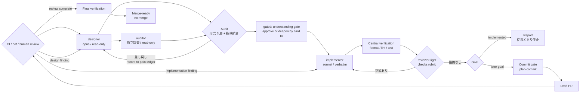

# draftsmith

Design-first task lifecycle for Claude Code — 設計ファーストのinner loopを、必要に応じてPR reviewまで延長するプラグイン。

One task in, reviewed change out by default; opt in to delivery through reviewed PR:
**requirements → design → audit → implementation → light review → PR → review → final verification**.



---

## English

### Why design-first

Letting one agent both design and implement invites two failure modes: design decisions
made implicitly mid-edit, and reviews that rubber-stamp whatever got written. draftsmith
splits the loop into three roles with **structurally enforced boundaries**:

- **designer** (opus, high effort) — investigates the codebase and returns a first design.
  It has **no Edit/Write tools**, so it cannot "just fix it real quick". Its output follows a
  5-part reply contract: verbatim brief / open questions with proposed defaults /
  broken-assumption report / traceability table / mini-ADRs for significant decisions only.
- **main session** — the orderer and auditor. Before dispatch it writes a 2–3 line
  *falsifiable prediction* of what the design should look like; the audit then checks
  (1) traceability against every acceptance criterion, (2) that ADRs actually cite the
  requirements, (3) divergence between prediction and result — a cheap tripwire against
  rubber-stamp auditing. Overruling the designer requires a written reason and alternative.
  Every rejection is recorded to a structured **pain ledger**. Repeated category/cause/target
  fingerprints produce reviewable proposals with evidence and falsification criteria; they
  never rewrite a Skill, Rule, or `constitution.md` automatically.
- **auditor** (opus, read-only) — a fresh-context semantic audit of the brief, run by
  default in the full lane and in light + independent audit (`--no-audit` to skip).
  The main session's 3-layer audit is formal; the auditor checks *meaning* across six lenses (seams, bug seeds, conventions,
  requirement coverage, vague instructions, ADR validity) — and, being independent of the
  ordering context, it counters the structural conflict of interest of an orderer grading
  its own order. High-confidence findings must be applied or explicitly overruled.
- **consultant** (opus, read-only, on-demand) — a second-opinion agent the main session
  must consult *before* overruling a designer proposal or rejecting a high-confidence
  auditor finding. Rejecting the consultant's advice too requires a second written
  justification citing primary sources — a double hurdle against self-serving dismissals.
- **implementer** (sonnet) — applies the brief verbatim. No design decisions. If an anchor
  in the brief doesn't match the file, it skips and reports instead of guessing.
- **reviewer-light** (sonnet, read-only) — loops until "no findings" across seven generic
  lenses (correctness, edge cases, semantic redundancy, readability, types, project
  conventions, tests), with an explicit out-of-scope list so it doesn't fight your linter.
  When a **rubric** was written up front (criterion / verification method / expected
  result per acceptance criterion), it checks that first — measured, not the implementer's
  self-report — before the seven lenses.

### Install

```
/plugin marketplace add kaionn/draftsmith
/plugin install draftsmith@draftsmith
```

### Usage

Claude Code and Codex can select draftsmith directly from a natural-language request; users do not
need to type the command name. For example:

```
Design and implement this change.
Implement this and open a PR.
Continue CI and review follow-up for this PR.
Take this PR through merge-ready.
```

The explicit command remains available when flags are useful:

```
/draftsmith <your requirement in natural language>
/draftsmith --gated <requirement>
/draftsmith --light <requirement>   # force the light lane
/draftsmith --full <requirement>    # force the full lane
/draftsmith --no-audit <requirement> # skip the independent design audit
/draftsmith --fable <requirement>    # run the designer on the Fable model
/draftsmith --through-review <requirement> # continue through human PR review
/draftsmith --from=delivery --goal=merge_ready <PR> # start at an existing branch/PR
/draftsmith --from=delivery --goal=merged <PR> # merge-ready後に別々のready/merge gate
```

The default goal remains `implemented`, preserving the existing behavior. Delivery is selected only
when the natural-language request names a later endpoint, or explicitly with `--through-review`, a
later `--goal`, or `--from=delivery`. Goals are `implemented`, `pr_open`,
`review_requested`, `review_complete`, `merge_ready`, and `merged`. The `merged` goal still stops
at separate ready and merge approval gates; selecting the goal is not standing authorization.

PR feedback is classified before action. Implementation findings return to a targeted implementer
and reviewer-light pass; design or requirement findings return to designer and auditor; questions,
replies, resolves, and ambiguous decisions stop at a human gate. Delivery state is stored under Git
metadata so CI and review waits can resume in a later run without dirtying the working tree. A
cross-process lock plus optimistic `revision` check rejects concurrent stale updates.

Park the run where the next input is external: write a prose note, run `delivery_state.py park`,
and close the session. The next session gets that note back from the SessionStart hook, together
with the phase, the PR, and whether HEAD moved since the park. A Stop hook blocks only when the
run sits in `wait_human_review`, `review_complete`, or `merge_ready` and either the state or HEAD
has moved since the last park, so review round trips that never touch HEAD still count as unparked.

```
/diff-review                 # annotated review screen for uncommitted changes
/diff-review --staged        # staged changes only
/diff-review --base main     # whole-branch diff against a ref
```

`/diff-review` generates a self-contained HTML review screen from a diff: hunks are
split mechanically, a read-only **diff-analyzer** agent groups them into semantic
change groups (intent, tags, risk label, findings), and a deterministic build script
renders them with per-group approval checkboxes (persisted in localStorage) and a
progress bar. Hunk coverage (no missing / duplicated hunks) is machine-verified.
It never touches git state.

Analysis runs in **two passes** to counter sycophancy: pass 1 is blind (no plan or
background is given — the diff must stand on its own), pass 2 reconciles against the
plan, only annotating findings with plan context — never deleting or softening them.
Each finding carries adopt / reject buttons and comment fields; a **feedback builder**
section assembles the adopted findings plus your comments into a markdown block you
copy straight back into the working session.

```
/plan-commit                 # fold the plan file into a commit, then delete it
```

Once the design is confirmed, `/draftsmith` writes it to `plans/{task-slug}.md` — an
**ephemeral plan file** (skip with `--no-plan-file`). It is not a task ledger: it lives
for one task, feeds `/diff-review`'s pass-2 reconciliation automatically, and is finally
folded into the commit itself by `/plan-commit` — one-line subject plus the plan as the
commit body, previewed and human-approved — which then deletes the file. Design intent
ends up in git history instead of a stale document.

```
/verify-report               # E2E verification report with screenshot evidence
```

`/verify-report` closes the loop for UI-touching changes: the main session drives the
browser and captures screenshots per acceptance criterion (sourced from the plan file),
then an **evidence-reviewer** agent — which never sees the implementation diff — judges
each criterion from the screenshots alone: pass / fail / needs-human, with the burden of
proof on the evidence (no screenshot, no pass). The output is a single self-contained
HTML report: criteria × embedded screenshots × verdicts, plus a copy-paste summary for
the PR description. Full verdict coverage is machine-verified by the build script.

- **Autonomous mode (default)**: no human gates between requirement and "no findings".
  Open questions are settled with conservative assumptions (preserve behavior, minimize
  scope) and every such decision is listed in a "Decisions made by AI" section of the
  final report. One escape hatch: an open question that conservative assumptions
  genuinely cannot settle triggers a single targeted human question instead of a guess —
  and if that keeps happening, draftsmith suggests rerunning with `--gated`.
- **`--gated`**: strengthens the existing two human checkpoints without adding another flag.
  At the requirements checkpoint, draftsmith asks about one unresolved issue at a time,
  with a proposed default and one-line rationale, and does not finalize requirements while
  an important issue remains unresolved. At the design checkpoint, the designer's unchanged
  5-part reply provides reference-only display material and is projected with the finalized
  requirements into a self-contained HTML page
  (`/tmp/draftsmith-brief-{task-slug}.html`) in this order: one-sentence summary, reading
  prerequisites, structure, zero to five decision cards, and original evidence. Each existing
  card has an ID, decision, rationale, counterfactual, and a verbatim source reference visible
  in the evidence section. You either approve the implementation start or request a deeper
  explanation by card ID; unresolved questions stop implementation. No scored comprehension
  test or forced restatement is used.
- **`--fable`**: runs the designer on Fable (the tier above Opus) for this task. Fable is
  never used without explicit user permission — the flag, a go-ahead in conversation, or
  a one-time upgrade proposal draftsmith may make on clearly heavyweight tasks. The chosen
  model is recorded in the final report. Designer only; other agents keep their defaults.
- **Invariant gates (all goals)**: destructive operations and every external mutation remain
  human-gated. In delivery mode, commit, push, PR writes, review replies/resolves, review requests,
  ready, and merge are separate gates; the default `implemented` goal never commits or pushes.

### Lanes: full vs light

At entry, draftsmith scores the task on two independent axes and picks a lane from the
combination (overridable with `--full` / `--light`):

- **Axis A (breadth)** — `small` only when all of: ~1–3 files, no change to existing
  structure, public contracts, data model or dependency direction, and the edit anchors
  are obvious without investigation. Otherwise `large`.
- **Axis B (design judgement)** — `single` when the approach is unambiguous, `judged`
  when several approaches are viable and need comparison.

|  | Axis B = single | Axis B = judged |
|---|---|---|
| Axis A = small | light | light + independent audit |
| Axis A = large | full | full |

- **full** — the 7-step flow above.
- **light** — skips designer and auditor: the main session writes the verbatim brief
  itself, implementer applies it under the same no-guessing discipline, and reviewer-light
  runs a **single pass** instead of looping.
- **light + independent audit** — light plus one auditor pass over the brief the main
  session wrote. A small change that still carries a design choice keeps its independent
  audit without paying for the designer and consultant round trips; the lane is recorded
  as `light` with an `auditor_round` event. Only `--no-audit` removes that pass.

A doubtful axis A falls back to `large`. Escalation is one-way to full when axis A turns
out to be wrong (anchors need investigation, structural mismatch, spillover beyond 1–3
files) or when an auditor high finding demands a redesign; a change on axis B alone
switches to light + independent audit. The chosen lane, both axis verdicts and the
reasoning are always listed in the final report.

### Scope: what draftsmith deliberately does NOT own

- **No task ledger** — it processes exactly one task per invocation
- **No unrequested delivery** — the default `implemented` goal stops at a verified working-tree change
- **No automatic merge or release** — later goals can prepare and review one PR, but every external
  mutation is gated and merge/release remain outside the goal
- **No multi-task orchestration** — task ledgers and batches belong elsewhere

### Using alongside claude-code-harness

draftsmith is designed to slot into the gap left by
[claude-code-harness](https://github.com/Chachamaru127/claude-code-harness): harness owns
the outer loop (Plans.md ledger, work orchestration, review verdicts, memory), draftsmith
owns the inner loop of a single task. A working combination:

1. `harness-plan` — build the task ledger (Plans.md)
2. `/draftsmith <one task line from Plans.md>` — design-first execution of that task
3. Review the reported diff, commit it yourself
4. `harness-sync` — update the ledger markers

The two plugins stay loosely coupled: draftsmith reads a task *description*, never
harness's internal state.

With `/draftsmith-next --through-review`, the adapter propagates the later goal: draftsmith handles
the commit/PR/review lifecycle behind its human gates, and `harness-sync` runs only after a commit
actually exists. `--from=delivery` is intentionally rejected by draftsmith-next because a new
Plans.md task is a requirements entry; invoke draftsmith directly for an existing branch or PR.

### Example run

Real cycle against [signal-lab](https://github.com/kaionn/signal-lab) (a Next.js app),
task: *"make the weekly-digest loader survive missing / unparseable `meta.yaml` files"*:

- **designer** investigated the actual loader, returned a verbatim brief with a
  traceability table covering all 3 acceptance criteria, plus 2 open questions —
  each with a proposed default (e.g. "warn on null-parsing meta instead of silently
  skipping, because the requirement's goal is *noticing* breakage")
- **audit** passed: every AC mapped, decisions cited the requirement, result matched
  the pre-dispatch prediction (single-file change, no new files besides fixtures)
- **implementer** applied the brief; **reviewer-light** returned "no findings" in round 1
- the final report listed 2 decisions made autonomously, and surfaced a genuine
  out-of-scope discovery: a sibling loader (`lib/experiments.ts`) shares the same
  fragility — reported as a follow-up instead of silently fixed (scope guard working
  as intended). No commit, no push; the diff was left for the human.

### Related work

[BMAD-METHOD](https://github.com/bmadcode/BMAD-METHOD) ·
[GitHub Spec Kit](https://github.com/github/spec-kit) ·
[Superpowers](https://github.com/obra/superpowers) ·
Aider architect mode — draftsmith's niche is the tool-permission-enforced
designer/implementer split plus an auditable reply contract, at single-task granularity.

---

## 日本語

### なぜ設計ファーストか

1 つのエージェントに設計と実装を同時にやらせると、編集の手元で暗黙の設計判断が起き、
レビューは書かれたものの追認になりがち。draftsmith はループを 3 役に分割し、境界を
**ツール権限で構造的に**強制する。

- **designer**（opus / high）— コードベースを調査して一次設計を返す。**Edit/Write を
  持たない**ので「ちょっと直しておく」が物理的にできない。return は出力契約 5 要素
  （逐語 brief / 提案デフォルト付き確認事項 / 前提崩れ報告 / トレーサビリティ表 /
  重要判断のみの mini-ADR）に従う
- **main セッション** — 発注者兼監査者。dispatch 前に「反証可能な予測」を 2〜3 行書き、
  監査では (1) 全受け入れ基準とのトレーサビリティ照合 (2) ADR の要件引用チェック
  (3) 予測と成果物の乖離検査、の 3 層を回す。第 3 層は監査のゴム印化を検知する安価な
  仕掛け。designer の提案を覆すときは理由 + 代替案の明文化が必須。却下はカテゴリ別に
  **pain 台帳**へcategory・cause enum・target kindで記録される。同一fingerprintが2件以上なら、
  根拠・変更先・before/after・期待効果・反証方法を持つproposalになる。Skill、Rule、
  `constitution.md`を自動変更せず、人間が採否を決める
- **auditor**（opus / read-only）— brief をフレッシュコンテキストで意味的に
  監査する独立監査層。full と `light + 独立audit` で既定実行（`--no-audit` で省略可）。
  後者では designer を省く代わりに main 自身が書いた brief を監査する。main の 3 層は
  形式の検査なので、意味の検査（接合面・バグの芽・規約準拠・要件充足の中身・設計の
  甘さ・mini-ADR の妥当性の 6 観点）を発注の経緯から独立した立場で担う。発注者が
  自分の発注物を評価する構造的な利益相反への対策でもある。high 信頼度の指摘は
  反映か明示的な棄却かの二択で、黙殺できない
- **consultant**（opus / read-only / on-demand）— designer 提案の覆しと auditor の
  high 指摘の棄却の直前に、main が必ず諮問する独立第二意見。consultant の助言まで
  棄却するには一次資料の引用付きで二段目の明文化が要る。独断棄却への二重のハードル
- **implementer**（sonnet）— brief を逐語適用する。設計判断はしない。brief のアンカーが
  実ファイルと一致しなければ、推測で埋めずスキップ報告する
- **reviewer-light**（sonnet / read-only）— 7 つの汎用観点（正確性・エッジケース・
  意味的冗長性・可読性・型・プロジェクト規約・テスト）で「指摘なし」までループする。
  観点外リストを明示していて、linter の仕事は奪わない。事前に **rubric**（受け入れ基準
  ごとの criterion / 検証方法 / 期待結果）が書かれていれば、7 観点より先にそれを
  自分で実測して照合する（実装者の自己申告ではなく rubric が正）

### インストール

```
/plugin marketplace add kaionn/draftsmith
/plugin install draftsmith@draftsmith
```

### 使い方

Claude Code/Codexは自然言語の依頼からdraftsmithを選択できるため、コマンド名の入力は不要。

```
この変更を設計から実装して
実装してPRを作って
このPRのCI・レビュー対応を続けて
このPRをmerge-readyまで進めて
```

flagを指定したい場合は、従来どおり明示コマンドも利用できる。

```
/draftsmith <要件を自然言語で>
/draftsmith --gated <要件>
/draftsmith --light <要件>    # light レーンを強制
/draftsmith --full <要件>     # full レーンを強制
/draftsmith --no-audit <要件> # auditor 独立監査を省略
/draftsmith --fable <要件>    # designer を Fable モデルで起動
/draftsmith --through-review <要件> # human PR review完了まで続行
/draftsmith --from=delivery --goal=merge_ready <PR> # 既存branch/PRから開始
/draftsmith --from=delivery --goal=merged <PR> # ready化・mergeの個別承認まで含む
```

既定goalは従来どおり`implemented`。deliveryは自然言語で後段の到達点を依頼した場合、または
`--through-review`、後段`--goal`、`--from=delivery`を指定した場合だけ有効になる。
goalは`implemented` / `pr_open` /
`review_requested` / `review_complete` / `merge_ready` / `merged`。`merged` goalでもready化と
mergeは別々のhuman gateで、goal指定だけでは実行しない。

PR feedbackは実行前に分類する。実装指摘はtargeted implementer + reviewer-lightへ、
設計・要件指摘はdesigner + auditorへ戻す。質問、reply、resolve、曖昧な判断はhuman gateで
停止する。delivery stateはGit metadata配下に保存され、working treeを汚さずCI/review待ちを
別runから再開できる。cross-process lockとoptimistic `revision`照合により、Claude/Codexの
古いstate更新を拒否する。

次の入力が外部になる地点でrunをparkする。散文のnoteを書いて`delivery_state.py park`を叩き、
sessionを閉じる。次のsessionはSessionStart hookからnoteとphase、PR、park後のHEAD差分を受け取る。
Stop hookは`wait_human_review` / `review_complete` / `merge_ready`で、前回のparkからstateかHEADの
どちらかが動いているときだけblockする。HEADを動かさないreview往復も未parkとして扱う。

開始前診断と再開状況は読み取り専用で確認できる。

```bash
python3 skills/draftsmith/scripts/run_inspect.py --repo . doctor
python3 skills/draftsmith/scripts/run_inspect.py --repo . status
python3 skills/draftsmith/scripts/run_inspect.py --repo . run-card --lane full
```

全runはopaque IDのv2 telemetryを開始・event・finishで記録できる。receiptはbranch、repo、task、
PR番号、本文、command、authorizationを持たず、`implemented`も終端として記録する。v1 receiptは
上書きせずread-onlyで改善分析へ使う。ローカルevidence packetはclean worktree、完全OID、PR head
一致、全AC coverageを必須とし、review cockpitはplan / rubric / diff-review / verify-report /
evidenceへの索引だけを生成する。外部投稿は別のhuman gateである。

反復signalのproposalは人間が採否を決める。採用後は5件の新しいreceiptで発生率を比較し、下がらない
場合だけ撤回候補として提示する。Skill、Rule、constitutionの適用・撤回を自動実行しない。
既存の`plan`成果物は一次入力として再利用し、`diff-review`、`verify-report`、`plan-commit`は各成果物の
正本として呼び出す。別のlifecycle stateを持つSkillはdraftsmith deliveryと同じrunで併用しない。

```
/diff-review                 # 未コミット差分の解説つきレビュー画面
/diff-review --staged        # ステージ済みのみ
/diff-review --base main     # 指定 ref とのブランチ差分
```

`/diff-review` は差分から自己完結 HTML のレビュー画面を生成する。hunk 分割は機械的に、
意味づけは読み取り専用の **diff-analyzer** agent が変更グループ（意図・タグ・リスク・
指摘）として行い、決定的なビルドスクリプトが承認チェックボックス（localStorage 永続）と
進捗バー付きで描画する。hunk の被覆（漏れ・重複）は機械検証される。
git の状態には一切触れない。

分析は忖度対策の **2 パス制**: Pass 1 は plan・背景を渡さない blind 分析（差分単体で
妥当かだけを見る）、Pass 2 で plan と照合して備考を追記する — 指摘の削除・弱体化は
禁止。各指摘には採用 / 却下ボタンとコメント欄が付き、**フィードバック組み立て**
セクションが採用された指摘 + コメントを markdown に整形、クリップボードにコピーして
元の作業セッションへそのまま貼り戻せる。

```
/plan-commit                 # plan ファイルをコミットに畳み込んで削除
```

`/draftsmith` は設計確定後に `plans/{task-slug}.md` へ**一時 plan ファイル**を書き出す
（`--no-plan-file` で省略可）。これはタスク台帳ではない: 1 タスク分だけ生きて、
`/diff-review` の Pass 2 照合に自動で使われ、最後は `/plan-commit` がコミットへ
畳み込む — subject 一行 + body に plan 本文、プレビューを人間が承認してからコミットし、
plan ファイルを削除する。設計意図は陳腐化するドキュメントではなく git 履歴に残る。

```
/verify-report               # 証跡スクショ付き E2E 検証レポート
```

`/verify-report` は画面に触れる変更のループを閉じる: main がブラウザを操作して
受け入れ基準（plan ファイル由来）ごとに証跡スクショを収集し、**実装 diff を一切
見ていない evidence-reviewer** agent がスクショだけを目視して pass / fail /
要人間確認を判定する — 立証責任は証跡側にあり、スクショが無い AC は pass に
ならない。出力は AC × 埋め込みスクショ × 判定の自己完結 HTML レポートで、
PR description への転記用サマリー（コピーボタン付き）を含む。全 AC の判定被覆は
ビルドスクリプトが機械検証する。

- **自律モード（既定）**: 要件入力から「指摘なし」まで人間ゲートなしで自走する。
  未決事項は保守的仮定（既存挙動維持・スコープ最小）で確定し、下した判断はすべて
  完了報告の「AI が下した判断」節に一覧で出る。逃げ道を一つだけ持つ:
  保守的仮定で埋めきれない未決事項に限り、推測せずその 1 点だけを人間に確認する。
  これが頻発するタスクには `--gated` での仕切り直しを提案する
- **`--gated`**: 新しいflagを増やさず、既存の要件確定・設計確定の2ゲートを強化する。
  要件gateでは重要な未決事項を一度に一論点ずつ、推奨デフォルトと理由付きで確認し、
  未解消の論点が残る間は要件を確定しない。設計gateではdesignerの出力契約5要素を変えず、
  要素1の参照専用表示素材と確定要件を自己完結HTML
  （`/tmp/draftsmith-brief-{task-slug}.html`）へ「一言要約、読む前提、構造、0〜5件の判断カード、
  原文根拠」の順に機械的に投影する。存在する各カードはID、判断、理由、別案を選んだ場合に
  壊れること、HTML内で確認できる逐語の原文根拠を持つ。人間は実装開始の承認かカード ID を
  指定した深掘りを選び、疑問が未解消なら実装へ進まない。理解度の採点や正解文の復唱は要求しない
- **`--fable`**: designer を Fable（Opus 上位ティア）で起動する。Fable の使用には必ず
  ユーザー許可が要る — フラグ指定・会話での明示許可・重量級タスクでの 1 回だけの
  昇格提案への承認のいずれか。選択モデルは完了報告に記録される。対象は designer のみ
- **不変ゲート（全goal共通）**: 破壊的操作と外部変更は常に人間確認。delivery modeでも
  commit、push、PR書き込み、review reply/resolve、review依頼、ready、mergeは別々のgate。
  既定の`implemented` goalはcommit / pushを行わない

### レーン: full と light

入口で「変更の広がり（軸 A）」と「設計判断の有無（軸 B）」を別々に判定し、その組み合わせで
レーンを選ぶ（`--full` / `--light` で強制指定も可能）:

- **軸 A** — 目安 1〜3 ファイル・既存構造や公開契約やデータモデルや依存方向を変えない・
  変更アンカーが調査不要で自明、をすべて満たせば `小`。1 つでも欠けるか迷えば `大`
- **軸 B** — 実装方針が一意なら `一意`、方針が複数ありえて比較が要るなら `要判断`

|  | 軸 B = 一意 | 軸 B = 要判断 |
|---|---|---|
| 軸 A = 小 | light | light + 独立audit |
| 軸 A = 大 | full | full |

- **full** — 上記の 7 ステップフロー
- **light** — designer と auditor を省略して main が逐語 brief を直接書き、implementer は同じ
  「推測しない」規律で適用、reviewer-light はループせず **1 巡のみ**
- **light + 独立audit** — light に auditor 1 巡を足したレーン。小さいが設計判断を含む変更に対し、
  designer と consultant の往復を払わずに独立監査だけを残す。レーンは `light` として記録し、
  auditor の起動を `auditor_round` イベントに残す。省略できるのは `--no-audit` だけ

軸 A が崩れた場合（アンカーに調査が必要・構造的な食い違い・1〜3 ファイルを超える波及）と、
auditor の high 指摘が設計の作り直しを求める場合は full へ一方向に昇格する。軸 B だけが
変わった場合は light + 独立audit へ切り替える。選んだレーン・両軸の判定・理由は完了報告に
必ず記録される。

### draftsmith が意図的に持たないもの

- **タスク台帳を持たない** — 1 回の起動で 1 タスクだけ処理する
- **依頼なしにdeliveryへ進まない** — 既定の`implemented` goalは検証済みのワーキングツリー変更で止まる
- **自動merge・releaseをしない** — 後段goalは単一PRのreviewまで。外部変更は個別gate
- **複数タスクを一括処理しない** — 台帳・batch orchestrationは他に任せる

### 構成

```
.claude-plugin/plugin.json      # プラグイン manifest
.claude-plugin/marketplace.json # self-marketplace（単一リポで配布）
agents/designer.md              # 一次設計（読み取り専用）
agents/auditor.md               # 独立設計監査（読み取り専用・full レーン既定）
agents/consultant.md            # 覆し判断の独立第二意見（読み取り専用・on-demand）
agents/implementer.md           # 逐語適用（設計判断なし）
agents/reviewer-light.md        # 軽量レビュー（定型出力・rubric 照合）
scripts/audit-ledger.sh         # 監査 pain 台帳（record / promote-check）
agents/diff-analyzer.md         # 差分の意味グルーピング（読み取り専用）
agents/evidence-reviewer.md     # 証跡スクショの独立判定（読み取り専用・vision）
skills/draftsmith/SKILL.md      # routing・不変条件・段階ロード
skills/draftsmith/templates/    # 要件書・出力契約・mini-ADR・plan ファイル・rubric・brief-visual・park note
skills/draftsmith/references/   # full/light/artifact/deliveryの条件付き手順
skills/draftsmith/scripts/      # state・telemetry・inspect・evidence・cockpit helper
skills/draftsmith/scripts/check_reply_contract.py # designer-return.md の5要素・AC網羅・digest検査
skills/draftsmith/scripts/run_cost.py             # session transcript の role 別トークン集計（数値のみ）
skills/adapters/draftsmith-delivery-driver/SKILL.md # single-driver lease付きの再開adapter
skills/adapters/draftsmith-loop-improve/SKILL.md # receiptからproposal-only改善
skills/adapters/draftsmith-inspect/SKILL.md # doctor / status / run-card
skills/adapters/draftsmith-review-cockpit/SKILL.md # local artifact索引
skills/diff-review/SKILL.md     # 解説つき差分レビュー画面（/diff-review）
skills/diff-review/scripts/     # diff 分割・HTML ビルド（Python stdlib のみ）
skills/diff-review/templates/   # レビュー画面テンプレート
skills/plan-commit/SKILL.md     # plan ファイルの畳み込みコミット（/plan-commit）
skills/verify-report/SKILL.md   # 証跡スクショ付き E2E 検証レポート（/verify-report）
skills/verify-report/scripts/   # レポートビルド（Python stdlib のみ）
skills/verify-report/templates/ # レポートテンプレート
skills/adapters/                # タスク供給元ごとの橋渡し層
skills/adapters/draftsmith-next/SKILL.md # harness の Plans.md から 1 タスクを draftsmith へ橋渡し（/draftsmith-next）
tests/test_delivery_state.py    # delivery stateのphase・worktree・schema回帰テスト
tests/test_hooks.py             # SessionStart / Stop hookのsubprocess回帰テスト
hooks/draftsmith-hooks.json     # plugin hooks宣言（SessionStart / Stop）
hooks/*.sh                      # hook wrapper（失敗しても exit 0 で黙る）
```

## License

MIT
