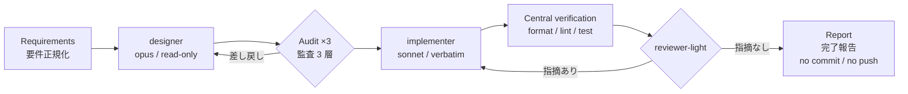

# draftsmith

Design-first inner loop for Claude Code — 設計ファーストのインナーループを Claude Code に足すプラグイン。

One task in, reviewed change out: **requirements → design → audit → implementation → light review**.



---

## English

### Why design-first

Letting one agent both design and implement invites two failure modes: design decisions
made implicitly mid-edit, and reviews that rubber-stamp whatever got written. draftsmith
splits the loop into three roles with **structurally enforced boundaries**:

- **designer** (opus, high effort) — investigates the codebase and returns a first design.
  It has **no Edit/Write tools**, so it cannot "just fix it real quick". Its output follows a
  5-part reply contract: verbatim brief / open questions with proposed defaults /
  broken-assumption report / traceability table / mini-ADRs for significant decisions only.
- **main session** — the orderer and auditor. Before dispatch it writes a 2–3 line
  *falsifiable prediction* of what the design should look like; the audit then checks
  (1) traceability against every acceptance criterion, (2) that ADRs actually cite the
  requirements, (3) divergence between prediction and result — a cheap tripwire against
  rubber-stamp auditing. Overruling the designer requires a written reason and alternative.
- **implementer** (sonnet) — applies the brief verbatim. No design decisions. If an anchor
  in the brief doesn't match the file, it skips and reports instead of guessing.
- **reviewer-light** (sonnet, read-only) — loops until "no findings" across seven generic
  lenses (correctness, edge cases, semantic redundancy, readability, types, project
  conventions, tests), with an explicit out-of-scope list so it doesn't fight your linter.

### Install

```
/plugin marketplace add kaionn/draftsmith
/plugin install draftsmith@draftsmith
```

### Usage

```
/draftsmith <your requirement in natural language>
/draftsmith --gated <requirement>
/draftsmith --light <requirement>   # force the light lane
/draftsmith --full <requirement>    # force the full lane
```

- **Autonomous mode (default)**: no human gates between requirement and "no findings".
  Open questions are settled with conservative assumptions (preserve behavior, minimize
  scope) and every such decision is listed in a "Decisions made by AI" section of the
  final report.
- **`--gated`**: adds two human checkpoints — requirement sign-off and design sign-off.
- **Invariant gates (both modes)**: destructive operations, writes to external systems,
  and `git commit` / `push` always require a human. draftsmith never commits or pushes.

### Lanes: full vs light

At entry, draftsmith classifies the task and picks one of two lanes (overridable with
`--full` / `--light`):

- **full** — the 7-step flow above. Default whenever any design judgement is involved.
- **light** — for tasks where the approach is unambiguous, the anchors are obvious from
  the requirement (no investigation needed), and the change is small (~1–3 files, no
  structural change). Skips designer: the main session writes the verbatim brief itself,
  implementer applies it under the same no-guessing discipline, and reviewer-light runs
  a **single pass** instead of looping. If mid-lane evidence shows the task was heavier
  than judged (anchors need investigation, structural mismatch, design-level review
  findings), it escalates one-way to full and restarts.

When in doubt the classifier falls back to full; the chosen lane and its reasoning are
always listed in the final report.

### Scope: what draftsmith deliberately does NOT own

- **No task ledger** — it processes exactly one task per invocation
- **No PR creation, no commit, no push** — it stops at a verified working-tree change
- **No full-cycle orchestration** — plan management and release flows belong elsewhere

### Using alongside claude-code-harness

draftsmith is designed to slot into the gap left by
[claude-code-harness](https://github.com/Chachamaru127/claude-code-harness): harness owns
the outer loop (Plans.md ledger, work orchestration, review verdicts, memory), draftsmith
owns the inner loop of a single task. A working combination:

1. `harness-plan` — build the task ledger (Plans.md)
2. `/draftsmith <one task line from Plans.md>` — design-first execution of that task
3. Review the reported diff, commit it yourself
4. `harness-sync` — update the ledger markers

The two plugins stay loosely coupled: draftsmith reads a task *description*, never
harness's internal state.

### Example run

Real cycle against [signal-lab](https://github.com/kaionn/signal-lab) (a Next.js app),
task: *"make the weekly-digest loader survive missing / unparseable `meta.yaml` files"*:

- **designer** investigated the actual loader, returned a verbatim brief with a
  traceability table covering all 3 acceptance criteria, plus 2 open questions —
  each with a proposed default (e.g. "warn on null-parsing meta instead of silently
  skipping, because the requirement's goal is *noticing* breakage")
- **audit** passed: every AC mapped, decisions cited the requirement, result matched
  the pre-dispatch prediction (single-file change, no new files besides fixtures)
- **implementer** applied the brief; **reviewer-light** returned "no findings" in round 1
- the final report listed 2 decisions made autonomously, and surfaced a genuine
  out-of-scope discovery: a sibling loader (`lib/experiments.ts`) shares the same
  fragility — reported as a follow-up instead of silently fixed (scope guard working
  as intended). No commit, no push; the diff was left for the human.

### Related work

[BMAD-METHOD](https://github.com/bmadcode/BMAD-METHOD) ·
[GitHub Spec Kit](https://github.com/github/spec-kit) ·
[Superpowers](https://github.com/obra/superpowers) ·
Aider architect mode — draftsmith's niche is the tool-permission-enforced
designer/implementer split plus an auditable reply contract, at single-task granularity.

---

## 日本語

### なぜ設計ファーストか

1 つのエージェントに設計と実装を同時にやらせると、編集の手元で暗黙の設計判断が起き、
レビューは書かれたものの追認になりがち。draftsmith はループを 3 役に分割し、境界を
**ツール権限で構造的に**強制する。

- **designer**（opus / high）— コードベースを調査して一次設計を返す。**Edit/Write を
  持たない**ので「ちょっと直しておく」が物理的にできない。return は出力契約 5 要素
  （逐語 brief / 提案デフォルト付き確認事項 / 前提崩れ報告 / トレーサビリティ表 /
  重要判断のみの mini-ADR）に従う
- **main セッション** — 発注者兼監査者。dispatch 前に「反証可能な予測」を 2〜3 行書き、
  監査では (1) 全受け入れ基準とのトレーサビリティ照合 (2) ADR の要件引用チェック
  (3) 予測と成果物の乖離検査、の 3 層を回す。第 3 層は監査のゴム印化を検知する安価な
  仕掛け。designer の提案を覆すときは理由 + 代替案の明文化が必須
- **implementer**（sonnet）— brief を逐語適用する。設計判断はしない。brief のアンカーが
  実ファイルと一致しなければ、推測で埋めずスキップ報告する
- **reviewer-light**（sonnet / read-only）— 7 つの汎用観点（正確性・エッジケース・
  意味的冗長性・可読性・型・プロジェクト規約・テスト）で「指摘なし」までループする。
  観点外リストを明示していて、linter の仕事は奪わない

### インストール

```
/plugin marketplace add kaionn/draftsmith
/plugin install draftsmith@draftsmith
```

### 使い方

```
/draftsmith <要件を自然言語で>
/draftsmith --gated <要件>
/draftsmith --light <要件>   # light レーンを強制
/draftsmith --full <要件>    # full レーンを強制
```

- **自律モード（既定）**: 要件入力から「指摘なし」まで人間ゲートなしで自走する。
  未決事項は保守的仮定（既存挙動維持・スコープ最小）で確定し、下した判断はすべて
  完了報告の「AI が下した判断」節に一覧で出る
- **`--gated`**: 要件確定・設計確定の 2 ゲートが人間確認になる
- **不変ゲート（両モード共通）**: 破壊的操作・外部システムへの書き込み・
  `git commit` / `push` は常に人間確認。draftsmith は commit / push を一切しない

### レーン: full と light

入口でタスクの軽重を判定し、2 レーンのどちらかを自動選択する（`--full` / `--light` で
強制指定も可能）:

- **full** — 上記の 7 ステップフロー。設計判断が少しでも絡むならこちら
- **light** — 方針が一意・アンカーが要件から自明（調査不要）・変更が小さい
  （目安 1〜3 ファイル・構造変更なし）タスク向け。designer を省略して main が逐語 brief を
  直接書き、implementer は同じ「推測しない」規律で適用、reviewer-light はループせず
  **1 巡のみ**。実行中に判定より重いと分かったら（アンカーに調査が必要・構造的な
  食い違い・設計に踏み込むレビュー指摘）、full へ一方向に昇格してやり直す

迷ったら full に倒す保守的判定で、選んだレーンと理由は完了報告に必ず記録される。

### draftsmith が意図的に持たないもの

- **タスク台帳を持たない** — 1 回の起動で 1 タスクだけ処理する
- **PR 作成・commit・push をしない** — 検証済みのワーキングツリー変更で止まる
- **フルサイクルのオーケストレーションをしない** — 計画管理・リリースは他に任せる

### 構成

```
.claude-plugin/plugin.json      # プラグイン manifest
.claude-plugin/marketplace.json # self-marketplace（単一リポで配布）
agents/designer.md              # 一次設計（読み取り専用）
agents/implementer.md           # 逐語適用（設計判断なし）
agents/reviewer-light.md        # 軽量レビュー（定型出力）
skills/draftsmith/SKILL.md      # メインフロー（7 ステップ）
skills/draftsmith/templates/    # 要件書・出力契約・mini-ADR
```

## License

MIT
